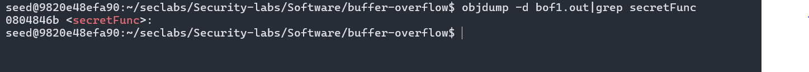
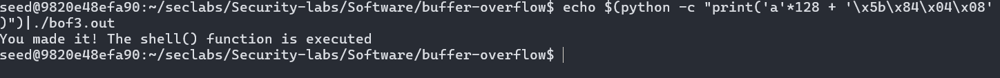

# Bof 1
## Source code of Bof1

## Stack frame of Bof1

## How to do Bof1

Create bof1.out file

Get the address of the secretFunc

Use the address of the secretFunc to change the return address of vuln to secretFunc and we finish bof1
# Bof2 
## Source code of Bof2

## Stack frame of Bof2

# How to do Bof2

Create bof2.out file

Use echo and check if you are on the right way

Now that we are on the right way change \x02 to \xef\xbe\xad\xde and we are finished with bof2
# Bof3
## Source code of Bof3

## Stack frame of Bof3

## How to do Bof3

Create bof3.out file

Use objdump to get address of shell function

Now we use the address of shell function to change the func funtion to shell and we finish with bof 3