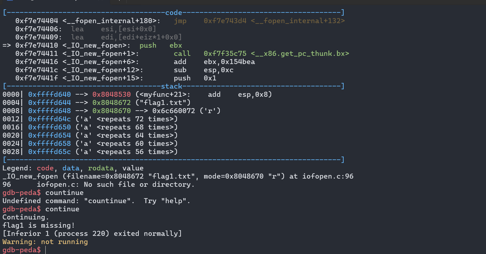

# CTF
## Source code of ctf

## Stack frame of ctf

## How to do ctf

Create ctf.out file

Now we use objdump to get address of myfunc function
Then we use gdb -q ctf.out and make a breakpoint at myfunc

According to the code we see that  in myfunc there is a check for the file flag1.txt and if we try to overwrite it at this moment this will happen

So to avoid it we need to create a flag1.txt

Now we can use myfunc
But we need to to see where the p and q of my func are, to do that we need to use disas myfunc to know where it is after doing that we will have these results

Use r echo to change return adress  of vuln to myfunc

Now we will need to set p and q value

And we are finished